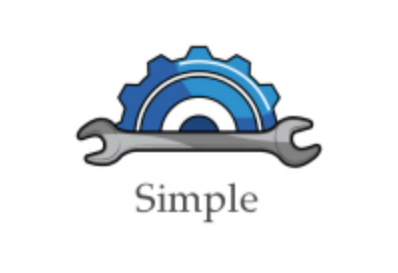

The Simple Programming Language
============

## Download
You can download the last version of the Simple Programming Language by cloning the github repository.

## Build
You can build the Simple Programing Language by compiling with:

`make`

## Test

Then you can test with:

`make test`

## Execute

You have two available binaries:

- `eval` evaluates a Simple expression from standard input and then output the result on standard output
- `repl` Read Eval Print Loop permits you to evaluate Simple expression from command-line

---

## Description

The Simple Programming Language is a functional programming language written in OCaml.

It supports:

- Integer
- Variable
- Addition
- Lambda
- Let
- Application

It is untyped, supports closures and use environments.

## Examples

`(lambda (x) x)` is the identity abstraction

`((lambda (x) x) 42)` applies 42 to the identity and then evaluates to 42

`(((lambda (x) (lambda (f) (f x))) 12) (lambda (a) a))` is the application function. It applies identity to 12, then returns 12.

## License

This project is licensed under the terms of the **MIT*** license